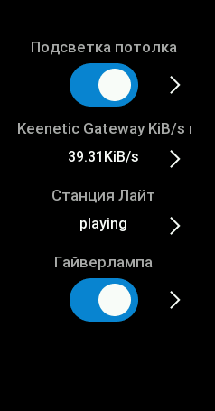
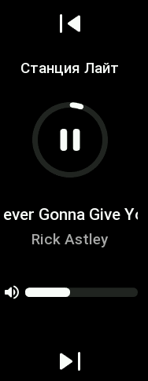
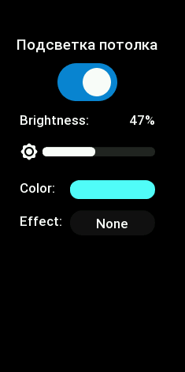

# Home Assistant companion for Zepp OS devices
Application that allows you to control Home Assistant

   

## Features
- (Binary) Sensor status
- Toggle switch
- Toggle light, see its effect (if presented), change its brightness (if this possible)
- Media player support with play/pause, prev/next, volume control
- Input boolean
- Start/stop scripts
- Enable/disable automations
- Update sensors info to Home Assistant REST API (Not stable! Turn off notications on the wearable for most stable experience)

### To Do:
- Fix some bugs in the ha-zepp settings page
- Editing colors for lights
- Open for suggestions

### Devices supported
- Mi Band 7 (You need modified Zepp app (see preparations))
- Amazfit T-Rex 2 (Official Zepp app is enough)
- All other Zepp OS devices, but there is no proper UI for them and you need to add the build configuration yourself

### Preparations
#### Mi Band 7 only
- [Modified Zepp App](https://4pda.to/forum/index.php?showtopic=797981&st=15700#entry122653549) (registration required)
- You need to connect Mi Band 7 to Modified Zepp App the same way you would with Zepp Life (google auth is not  supported)
#### General steps
- Download the official Zepp App
- You need to enable [Developer Mode](https://docs.zepp.com/docs/1.0/guides/tools/zepp-app/) in Zepp app
- Build and install the ha-zepp application yourself using the [Zeus CLI](https://docs.zepp.com/docs/1.0/guides/tools/cli/)
- Open the application settings and specify the addresses of Home Assistant, Long-lived access token and select the sensors you want to display on Zepp OS device
#### Home Assistant
- Long-lived access token (you can generate it on your-ha-instance.local/profile page)
- "If you are not using the [`frontend`](https://www.home-assistant.io/integrations/frontend/) in your setup then you need to add the [`api` integration](https://www.home-assistant.io/integrations/api/) to your `configuration.yaml` file."

### About the sensor updates to the Home Assitant REST API
Since it is not possible for the general public to access [Huami's WEB API](https://github.com/zepp-health/rest-api/wiki), I decided to make a background updater within this app to send the wearable sensor data to Home Assistant.
It uses the [alarm](https://docs.zepp.com/docs/1.0/reference/device-app-api/hmApp/alarm/alarmNew/) mechanism, which can open a page even when the device is inactive. When this page is opened, the POST requests are performed towards the HA REST API. However, notifications on the device (e.g. app notifications or the calendar notification) are remained open for a while (if you don't swipe it away), which can block this alarm mechanism from showing the ha-zepp page. If the ha-zepp page is blocked by a notification, you will see that if you swipe it away, the ha-zepp page will appear. If you don't swipe it away, the ZeppOS system eventually will remove all stored pages and notifications to save RAM and be more power efficient. If this ha-zepp page is not openend, ha-zepp is unable to create a new alarm, meaning the background updater will break. Therefore, it's best to `DISABLE ALL SORT OF NOTIFICATIONS` if you want this feature to work properly.
